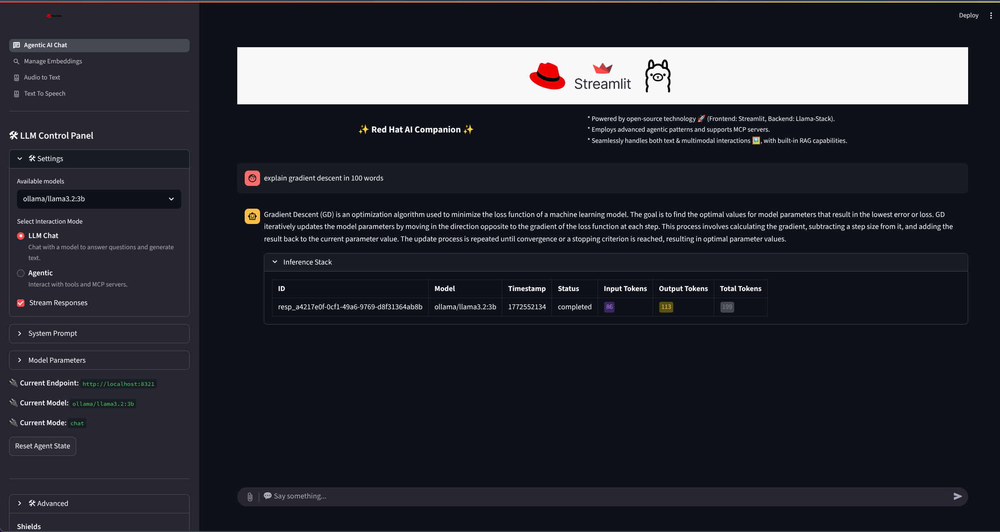

# LlamaChat

[](https://quay.io/repository/marcocaimi/llamachat)

**LlamaChat** is a multipage **Streamlit** app for chatting with an LLM via an **OGX / Llama-Stack OpenAI-compatible** backend, with optional:
- **Agentic mode** (tool use + MCP connectors)
- **Safety shields** (moderation models)
- **RAG** (document ingestion + embeddings + vector stores)
- **Audio** (Whisper ASR + Kokoro TTS; experimental)

This README documents the **current implementation** in this repository (files, config keys, and backend API requirements).

## Screenshot



## Architecture (how the app is structured)

### Entrypoint and pages

- **Entrypoint**: `main.py` registers Streamlit pages and runs navigation.
- **Pages**:
  - `pages/agentic_chat.py`: main chat UI. Supports:
    - **Chat mode** (LLM only) and **Agentic mode** (tools/MCP + optional file search toolgroup)
    - Optional **input/output shields**
    - Optional **RAG** via vector store IDs (backend-provided)
    - Chat history save/load/export (JSON + Markdown)
    - File upload:
      - **Images** are sent as `input_image` content (base64 data URL)
      - **Documents** are converted with **Docling** and appended as markdown context
  - `pages/embeddings.py`: document ingestion pipeline:
    - Convert files with **Docling**, chunk with `HybridChunker`
    - Create/select a vector store collection
    - Compute embeddings via backend and insert chunks via `vector_io.insert`
  - `pages/whisper_audio.py`: audio → text (Whisper via `transformers` pipeline; uses `torchcodec`)
  - `pages/tts_audio.py`: text → audio (Kokoro TTS; uses `torchcodec`)

### Core modules (shared implementation)

- **Configuration loader**: `libs/shared/settings.py` loads YAML into `libs/utils/parameters.py` and performs boot checks (creates chat history dir).
- **Session + persistence**: `libs/shared/session.py`
  - Manages `st.session_state` defaults
  - Lists models/providers/shields via backend HTTP endpoints
  - Saves/loads chat histories (JSON) and exports to Markdown
- **Agent wrapper**: `libs/shared/agent.py`
  - Uses the backend’s **Responses API** (`client.responses.create`) with optional tools + continuity via `previous_response_id`
  - Applies shields via `libs/shared/shields.py` (Moderations API)
- **Agent message model**: `libs/shared/state.py` (`AgentMessage` dataclass)
- **Tool / connector discovery**: `libs/shared/connectors_wrapper.py`
  - `GET /v1/tools` and `GET /v1beta/connectors`
  - MCP connectors are recognized by `connector_id` prefix `mcp::`
- **Response formatting for UI**: `libs/shared/responses.py` (formats responses + tool call summaries)
- **RAG ingestion utilities**: `libs/embeddings/embeddings.py`, `libs/embeddings/vectorio.py`
- **Audio utilities**: `libs/utils/audio_pipelines.py`

## Configuration

Configuration is loaded in this order:
1. `.env` (optional) → selects config file
2. YAML config file (default: `parameters.yaml`)

### `.env`

- `CONFIG_FILE`: YAML file to load (default: `parameters.yaml`)

Example:

```bash
CONFIG_FILE="parameters.yaml"
```

### `parameters.yaml` (important keys)

- `openai.default_local_api`: backend base URL (default is `http://localhost:8321`)
- `openai.api_key`: bearer token used for some HTTP calls (model/provider listing)
- `openai.model`: default LLM model ID (selected from `/v1/models`)
- `openai.shield_model`: default shield model (used for moderation calls)
- `openai.stream`: default streaming toggle for chat responses
- `openai.history_dir`: directory where chat histories are written (default `chat_histories`)
- `openai.latest_history_filename`: autosave filename (default `latest_chat.json`)

- `llm.system_prompt`: default system prompt (editable in UI)
- `llm.temperature`, `llm.timeout`, `llm.max_output_tokens`
- `llm.max_infer_iters`, `llm.max_tool_calls`, `llm.parallel_tool_calls`

- `vectorstore.embedding_dimensions`: expected embedding dimensionality for new vector collections

- `features.supported_data_formats`, `features.supported_img_formats`, `features.supported_audio_formats`

- `huggingface.apitoken`, `huggingface.local_dir`, `huggingface.cache_dir`:
  used by Whisper/Kokoro pages to download model snapshots.

## Backend API requirements (contract)

This repo does **not** ship the backend. The Streamlit app expects an OGX/Llama-Stack style backend that exposes (at minimum) the following APIs under `openai.default_local_api`:

### Model and metadata APIs (used to populate UI selectors)

- `GET /v1/models`
  - Used by `libs/shared/session.py` to list models; LLM and embedding models are filtered via `custom_metadata.model_type` (`llm`, `embedding`).
- `GET /v1/shields`
  - Used to list shield models for input/output shielding.
- `GET /v1/providers`
  - Used to list providers (e.g. `vector_io`) for embeddings/vector store operations.

### Agentic tooling discovery (Agentic mode only)

- `GET /v1/tools`
  - Lists toolgroups/tools available on the backend.
- `GET /v1beta/connectors`
  - Lists connectors. MCP connectors are selected when `connector_id` starts with `mcp::`.

### Inference APIs

- **Responses API**: used by `libs/shared/agent.py` via `client.responses.create(...)`
  - `previous_response_id` is used for multi-turn continuity.
  - In agentic mode, `tools=[...]` includes MCP server entries and optionally a `file_search` toolgroup with vector store ids.
- **Moderations API** (optional; required if you want shields)
  - Used by `libs/shared/shields.py` via `client.moderations.create(input=..., model=...)`.

### Vector store / embeddings APIs (RAG + embeddings page)

Used by `pages/embeddings.py` and (optionally) `pages/agentic_chat.py`:
- `vector_stores.list()` / `vector_stores.create(...)`
- `embeddings.create(input=[...], model=..., dimensions=...)`
- `vector_io.insert(vector_store_id=..., chunks=[...])`

## Requirements

- **Python**: `>= 3.13` (see `pyproject.toml`)
- **Runtime**: Streamlit (installed via project dependencies)
- **Audio features (experimental)**: `torch`, `torchcodec`, `torchaudio`, `ffmpeg` available on your system
- **Backend**: an OGX/Llama-Stack OpenAI-compatible endpoint reachable at `openai.default_local_api`

## Run locally (uv)

This repo is set up for **uv** (`uv.lock` is present).

```bash
uv sync
uv run streamlit run main.py
```

Streamlit defaults to `http://localhost:8501`.

## Run with Docker

`Dockerfile` starts Streamlit like this:

```bash
streamlit run --server.address $HOST --server.port $PORT main.py
```

Notes:
- The Dockerfile currently installs dependencies only from `requirements.txt` (or a single `*.txt` file). This repo’s primary dependency source is `pyproject.toml`/`uv.lock`.
- If you want to build the current Dockerfile without changing it, generate a `requirements.txt` from the lockfile (uv supports exporting requirements) and then build.
- You must still provide a reachable backend URL (via `parameters.yaml` and/or `.env`).

## Troubleshooting (known issues)

### macOS: `torchcodec` import errors / missing ffmpeg libraries

On macOS (notably macOS 26+), importing `torchcodec` can fail if dynamic libraries for ffmpeg are not visible.

Workaround (Homebrew + temporary `DYLD_LIBRARY_PATH`):

```bash
brew install ffmpeg@7
DYLD_LIBRARY_PATH="/opt/homebrew/opt/ffmpeg@7/lib:$DYLD_LIBRARY_PATH" uv run streamlit run main.py
```
