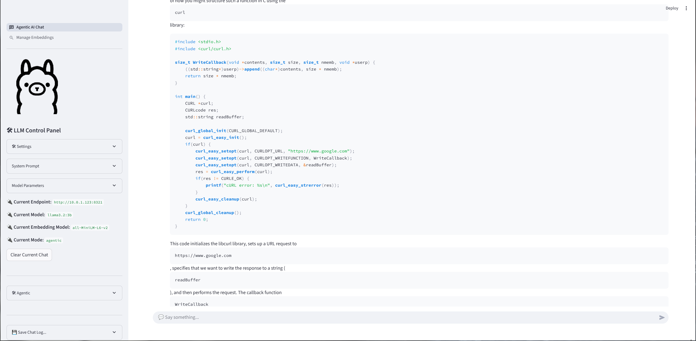

# LlamaChat

**LlamaChat** is a web application that allows users to chat with Large Language Models (LLMs). It provides flexibility to interact with LLMs either locally (on-prem) using technologies like **vLLM** or **Ollama** or through remote **OpenAI-compatible endpoints**.

With LlamaChat, users can easily chat with powerful LLMs both in private environments (for enhanced privacy and control) and using cloud-based APIs for scalability.

## Features

- **Local Chat**: Interact with LLMs hosted on-premises using **vLLM** or **Ollama**.
- **Remote Chat**: Connect to OpenAI-compatible endpoints for scalable LLM access.
- **User-Friendly Interface**: Simple web interface to initiate and maintain conversations with LLMs.
- **API Key Support**: Securely manage and switch between different API keys (for remote services).
- **Multiple Models**: Support for multiple LLM models such as GPT-based models, Ollama models, and others.

## Screenshot

## Installation

### Prerequisites

- Python 3.12+
- Streamlit
- A local Ollama/vLLM instance or a public OpenAI-Compatible API endpoint.

